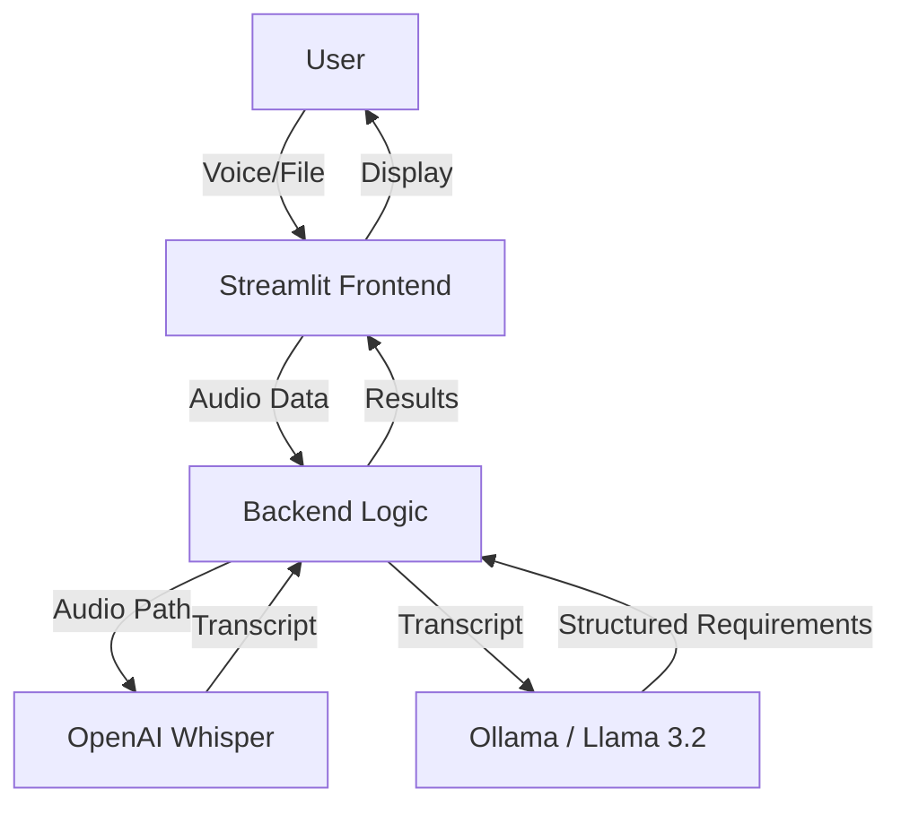

# Voice Requirement AI - technical Design Document

This document explains the internal working and implementation details of the Voice Requirement AI application.

## 1. High-Level Architecture

The application is built using a **Client-Server** architecture (logically) running within a single **Streamlit** process.

## 2. Code Structure

The project is minimalist, consisting of two main Python files in the `app/` directory:

### A. `app/logic.py` (Backend)
This module handles all "heavy lifting" and AI processing. It is designed to be independent of the UI.

*   **Transcription**: Uses `openai-whisper` (Base model) to convert audio files into text.
    *   *Implementation*: Checks for a local `bin/` folder to add to the system PATH so FFmpeg can be found.
*   **Intelligence**: Uses `langchain_ollama` to interface with the local Llama 3.2 model.
    *   *Prompting*: A specific prompt instructs the LLM to act as a Business Analyst.
    *   *Structured Output*: Uses Pydantic (`RequirementExtraction` class) to ensure the LLM returns a strict JSON list of requirements, preventing parsing errors.

### B. `app/main.py` (Frontend)
This is the Streamlit interface that the user interacts with.

*   **Reactive Model**: There is no "Analyze" button. The app reacts immediately to input changes.
*   **Caching**: Uses `@st.cache_data` to wrap the expensive `process_audio_data` function.
    *   *Why?* Streamlit re-runs the entire script on every interaction. Caching prevents re-transcribing the same audio file if the user switches tabs or interacts with other widgets.
*   **State Management**: Uses `st.status` to provide real-time feedback (Processing -> Transcribing -> Extracting -> Done).

## 3. Data Flow & processing Pipeline

1.  **Input**:
    *   **Recording**: `st.audio_input` captures microphone input as bytes.
    *   **Upload**: `st.file_uploader` captures file input as bytes.
2.  **Safety**: Input streams are reset using `.seek(0)` to ensure complete reading.
3.  **Temp Storage**:
    *   Audio bytes are written to a `tempfile.NamedTemporaryFile`.
    *   *Reason*: Whisper requires a file path on disk to process audio (via FFmpeg).
4.  **Processing**:
    *   **Step 1 (ASR)**: Whisper reads the temp file and returns a text transcript.
    *   **Step 2 (LLM)**: The transcript is passed to Ollama. The LLM extracts requirements based on the Pydantic schema.
5.  **Output**:
    *   The transcript and requirements list are returned to the UI for rendering.
6.  **Cleanup**: The temporary file is deleted to save space.

## 4. Key Technologies

*   **Python**: Core language.
*   **Streamlit**: Web framework for the UI.
*   **OpenAI Whisper**: State-of-the-art speech recognition (running locally).
*   **Ollama**: Local runner for Large Language Models.
*   **LangChain**: Framework for chaining the LLM prompt and structured output.
*   **FFmpeg**: Essential multimedia framework used by Whisper for audio decoding.

## 5. Technical Challenges & Solutions

*   **FFmpeg Dependency**: Whisper fails without FFmpeg.
    *   *Solution*: Created a PowerShell script (`setup_ffmpeg.ps1`) to download it locally and updated `logic.py` to auto-detect it.
*   **Streamlit Re-runs**: Continuous re-execution can be slow.
    *   *Solution*: Implemented `@st.cache_data` to ensure processing only happens when input changes.
*   **Structured Data**: LLMs can be chatty.
    *   *Solution*: Used `with_structured_output` to force a JSON response.
